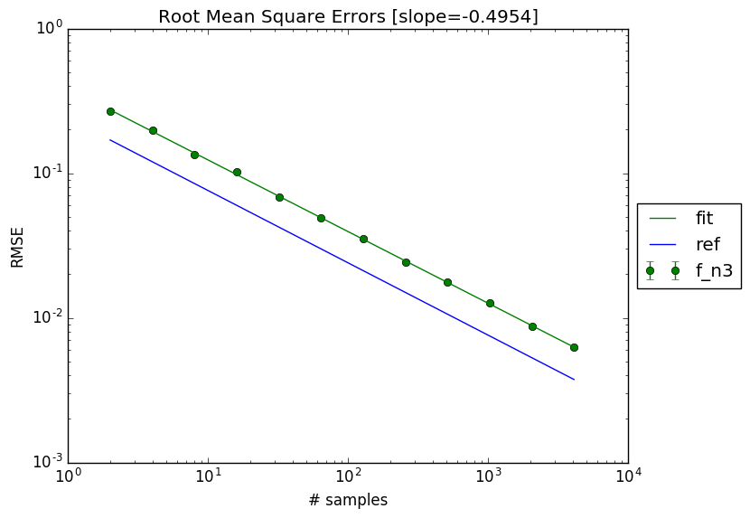
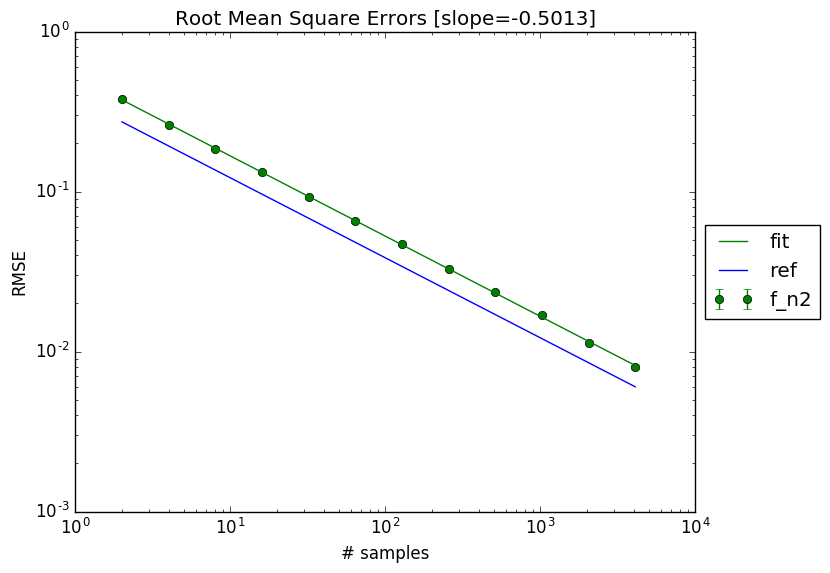
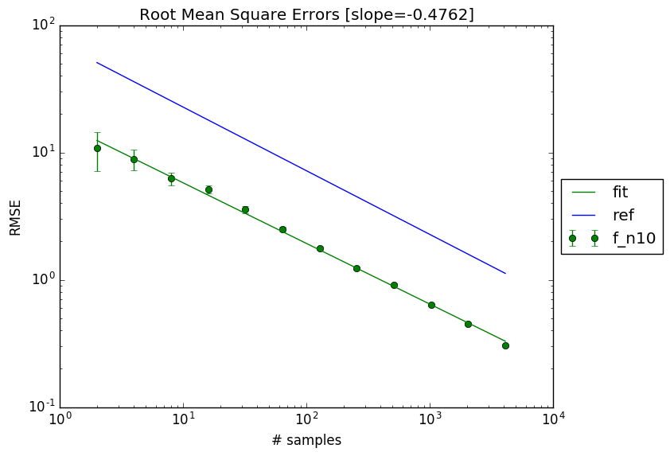
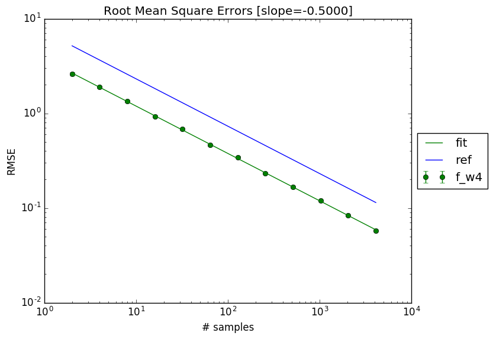
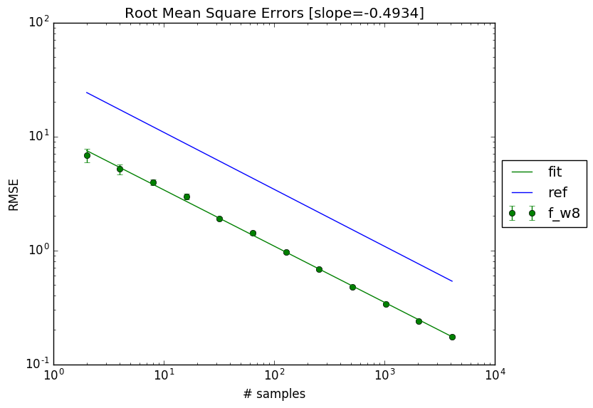
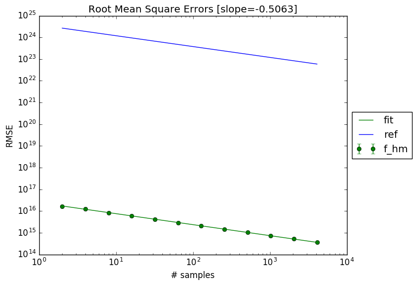
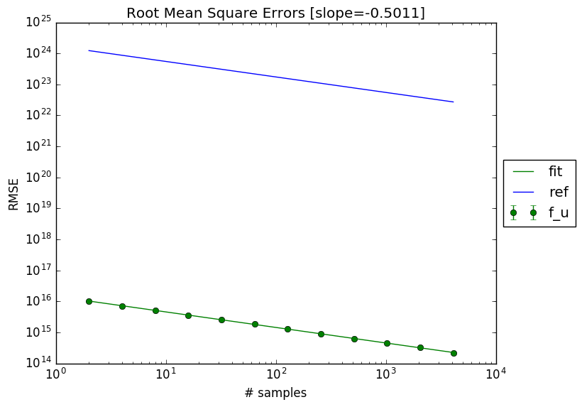
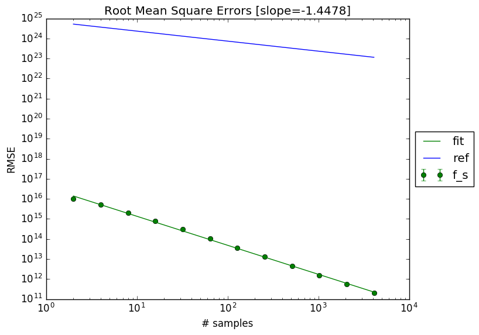
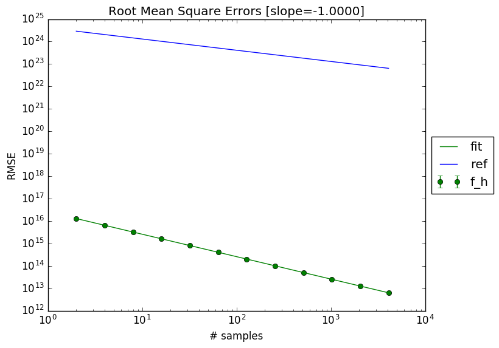

# MCExperiments

Teaching: Monte Carlo Integration Techniques

## About
Some Monte Carlo experiments used for teaching Monte Carlo Integration Techniques for the course *Problem Solving and Design: Part 3* (1st Semester - 2nd Bachelor of Science in Engineering).

## Use

### Basics

#### The effect of increasing the number of samples
<p align="center">

</p>

#### The effect of increasing the dimensionality
<p align="center">



</p>

#### The effect of increasing the domain
<p align="center">



</p>

```python
# Code
test.test_session1()
```

### Sampling strategies

#### Monte Carlo sampling strategies
<p align="center">



</p>

#### Quasi Monte Carlo sampling strategies
<p align="center">

</p>

```python
# Code
test.test_session2(a=3, n=3)
```
